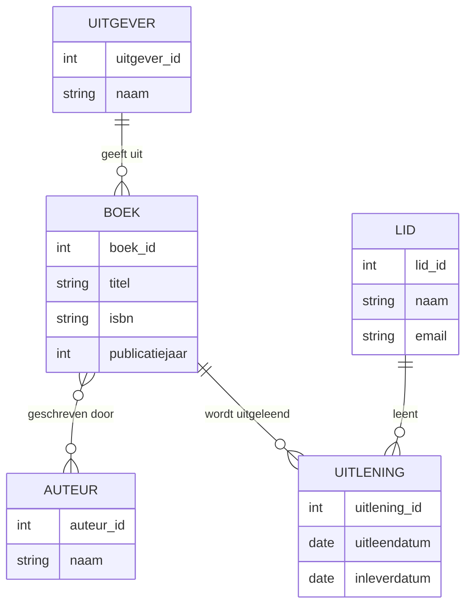
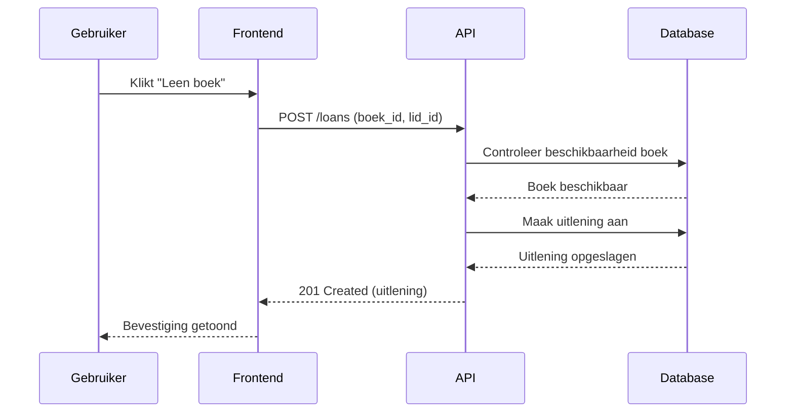
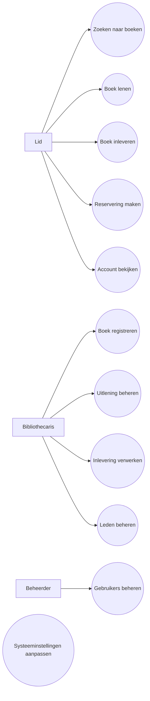
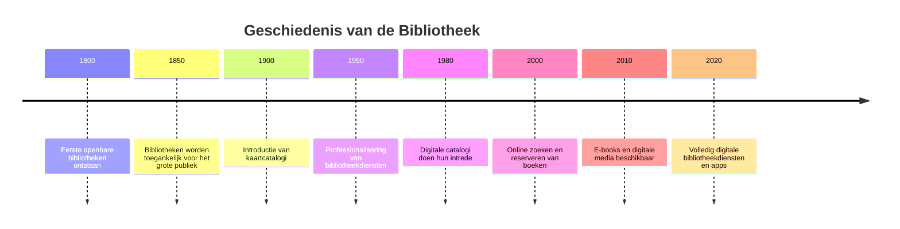

DIAGRAM 1 (ERD)

```mermaid
erDiagram
    BOEK {
        int boek_id
        string titel
        string isbn
        int publicatiejaar
    }

    AUTEUR {
        int auteur_id
        string naam
    }

    UITGEVER {
        int uitgever_id
        string naam
    }

    LID {
        int lid_id
        string naam
        string email
    }

    UITLENING {
        int uitlening_id
        date uitleendatum
        date inleverdatum
    }

    BOEK }o--o{ AUTEUR : "geschreven door"
    UITGEVER ||--o{ BOEK : "geeft uit"
    BOEK ||--o{ UITLENING : "wordt uitgeleend"
    LID ||--o{ UITLENING : "leent"
```

DIAGRAM 2 (Sequence)

```mermaid
sequenceDiagram
    participant Gebruiker
    participant Frontend
    participant API
    participant Database

    Gebruiker->>Frontend: Klikt "Leen boek"
    Frontend->>API: POST /loans (boek_id, lid_id)
    API->>Database: Controleer beschikbaarheid boek
    Database-->>API: Boek beschikbaar
    API->>Database: Maak uitlening aan
    Database-->>API: Uitlening opgeslagen
    API-->>Frontend: 201 Created (uitlening)
    Frontend-->>Gebruiker: Bevestiging getoond
```

DIAGRAM 3 (USECASE)

```mermaid
flowchart LR
    Lid[Lid]
    Bibliothecaris[Bibliothecaris]
    Beheerder[Beheerder]

    UC1((Zoeken naar boeken))
    UC2((Boek lenen))
    UC3((Boek inleveren))
    UC4((Reservering maken))
    UC5((Account bekijken))

    UC6((Boek registreren))
    UC7((Uitlening beheren))
    UC8((Inlevering verwerken))
    UC9((Leden beheren))

    UC10((Gebruikers beheren))
    UC11((Systeeminstellingen aanpassen))

    Lid --> UC1
    Lid --> UC2
    Lid --> UC3
    Lid --> UC4
    Lid --> UC5

    Bibliothecaris --> UC6
    Bibliothecaris --> UC7
    Bibliothecaris --> UC8
    Bibliothecaris --> UC9

    Beheerder --> UC10
```

```mermaid
timeline
    title Geschiedenis van de Bibliotheek

    1800 : Eerste openbare bibliotheken ontstaan
    1850 : Bibliotheken worden toegankelijk voor het grote publiek
    1900 : Introductie van kaartcatalogi
    1950 : Professionalisering van bibliotheekdiensten
    1980 : Digitale catalogi doen hun intrede
    2000 : Online zoeken en reserveren van boeken
    2010 : E-books en digitale media beschikbaar
    2020 : Volledig digitale bibliotheekdiensten en apps
```

