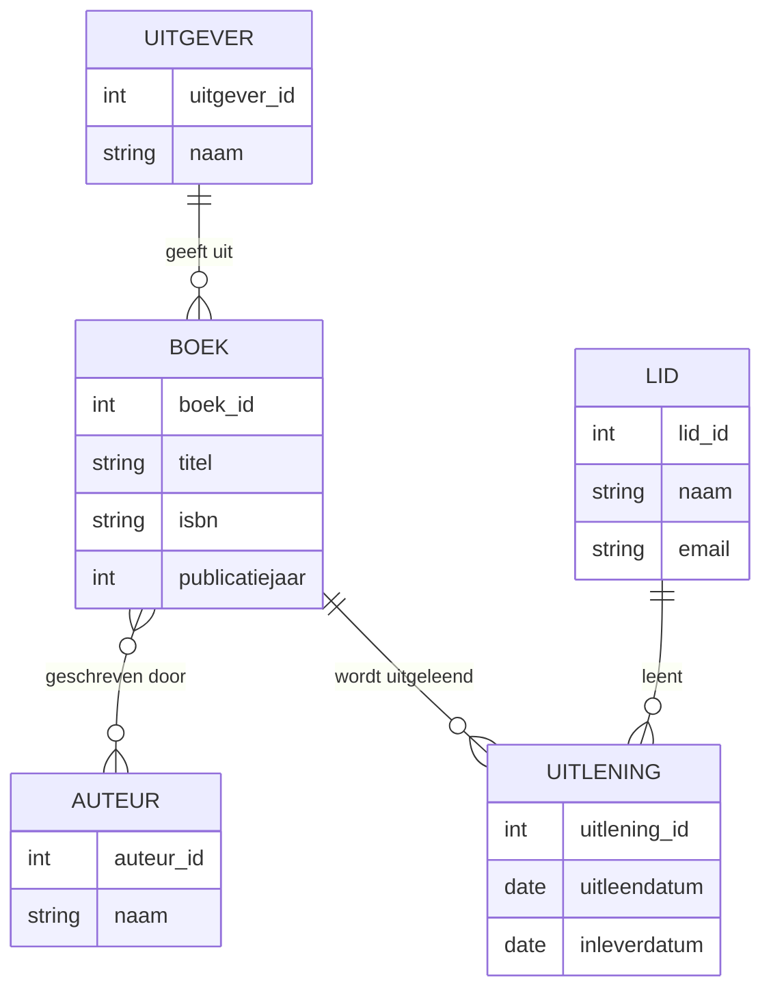

```mermaid
erDiagram
    BOEK {
        int boek_id
        string titel
        string isbn
        int publicatiejaar
    }

    AUTEUR {
        int auteur_id
        string naam
    }

    UITGEVER {
        int uitgever_id
        string naam
    }

    LID {
        int lid_id
        string naam
        string email
    }

    UITLENING {
        int uitlening_id
        date uitleendatum
        date inleverdatum
    }

    BOEK }o--o{ AUTEUR : "geschreven door"
    UITGEVER ||--o{ BOEK : "geeft uit"
    BOEK ||--o{ UITLENING : "wordt uitgeleend"
    LID ||--o{ UITLENING : "leent"
```
