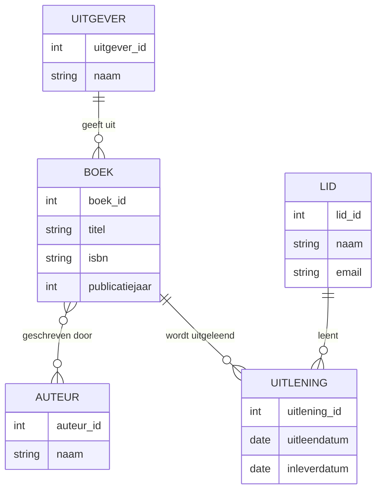
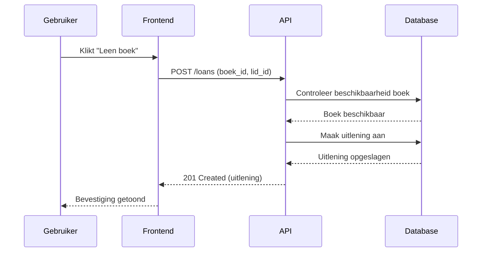

DIAGRAM 1 (ERD)


DIAGRAM 2 (Sequence)


DIAGRAM 3 (USECASE)
```mermaid
usecaseDiagram
    actor Lid
    actor Bibliothecaris
    actor Beheerder

    Lid --> (Zoeken naar boeken)
    Lid --> (Boek lenen)
    Lid --> (Boek inleveren)
    Lid --> (Reservering maken)
    Lid --> (Account bekijken)

    Bibliothecaris --> (Boek registreren)
    Bibliothecaris --> (Uitlening beheren)
    Bibliothecaris --> (Inlevering verwerken)
    Bibliothecaris --> (Leden beheren)

    Beheerder --> (Gebruikers beheren)
    Beheerder --> (Systeeminstellingen aanpassen)
```

