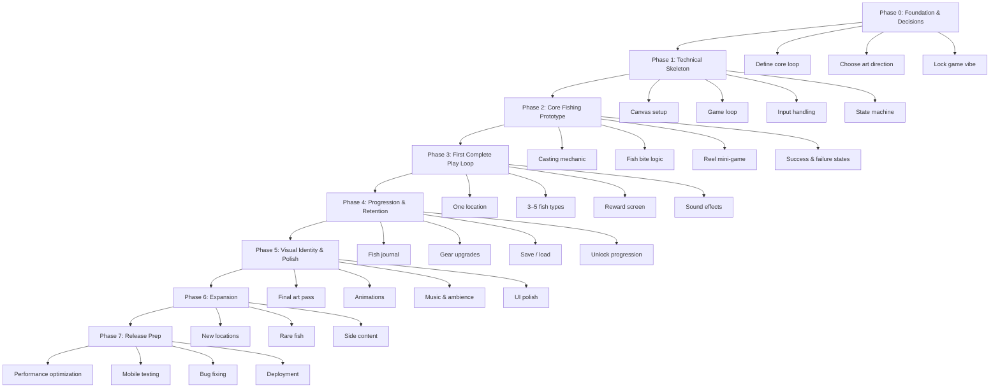
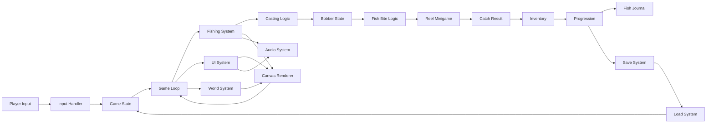

Roadmap Diagram:

```mermaid
flowchart TD
    A[Phase 0: Foundation & Decisions] --> B[Phase 1: Technical Skeleton]
    B --> C[Phase 2: Core Fishing Prototype]
    C --> D[Phase 3: First Complete Play Loop]
    D --> E[Phase 4: Progression & Retention]
    E --> F[Phase 5: Visual Identity & Polish]
    F --> G[Phase 6: Expansion]
    G --> H[Phase 7: Release Prep]

    %% Phase details
    A --> A1[Define core loop]
    A --> A2[Choose art direction]
    A --> A3[Lock game vibe]

    B --> B1[Canvas setup]
    B --> B2[Game loop]
    B --> B3[Input handling]
    B --> B4[State machine]

    C --> C1[Casting mechanic]
    C --> C2[Fish bite logic]
    C --> C3[Reel mini-game]
    C --> C4[Success & failure states]

    D --> D1[One location]
    D --> D2[3–5 fish types]
    D --> D3[Reward screen]
    D --> D4[Sound effects]

    E --> E1[Fish journal]
    E --> E2[Gear upgrades]
    E --> E3[Save / load]
    E --> E4[Unlock progression]

    F --> F1[Final art pass]
    F --> F2[Animations]
    F --> F3[Music & ambience]
    F --> F4[UI polish]

    G --> G1[New locations]
    G --> G2[Rare fish]
    G --> G3[Side content]

    H --> H1[Performance optimization]
    H --> H2[Mobile testing]
    H --> H3[Bug fixing]
    H --> H4[Deployment]


```

Dataflow chart:

```mermaid
flowchart LR
    UI[Player Input] --> INPUT[Input Handler]

    INPUT --> STATE[Game State]
    STATE --> LOOP[Game Loop]

    LOOP --> FISHING[Fishing System]
    LOOP --> UIRENDER[UI System]
    LOOP --> WORLD[World System]

    FISHING --> CAST[Casting Logic]
    CAST --> BOBBER[Bobber State]
    BOBBER --> BITE[Fish Bite Logic]
    BITE --> REEL[Reel Minigame]
    REEL --> RESULT[Catch Result]

    RESULT --> INVENTORY[Inventory]
    INVENTORY --> PROGRESSION[Progression]
    PROGRESSION --> JOURNAL[Fish Journal]

    WORLD --> RENDER[Canvas Renderer]
    FISHING --> RENDER
    UIRENDER --> RENDER

    PROGRESSION --> SAVE[Save System]
    SAVE --> LOAD[Load System]
    LOAD --> STATE

    FISHING --> AUDIO[Audio System]
    UIRENDER --> AUDIO

    RENDER --> LOOP
```
